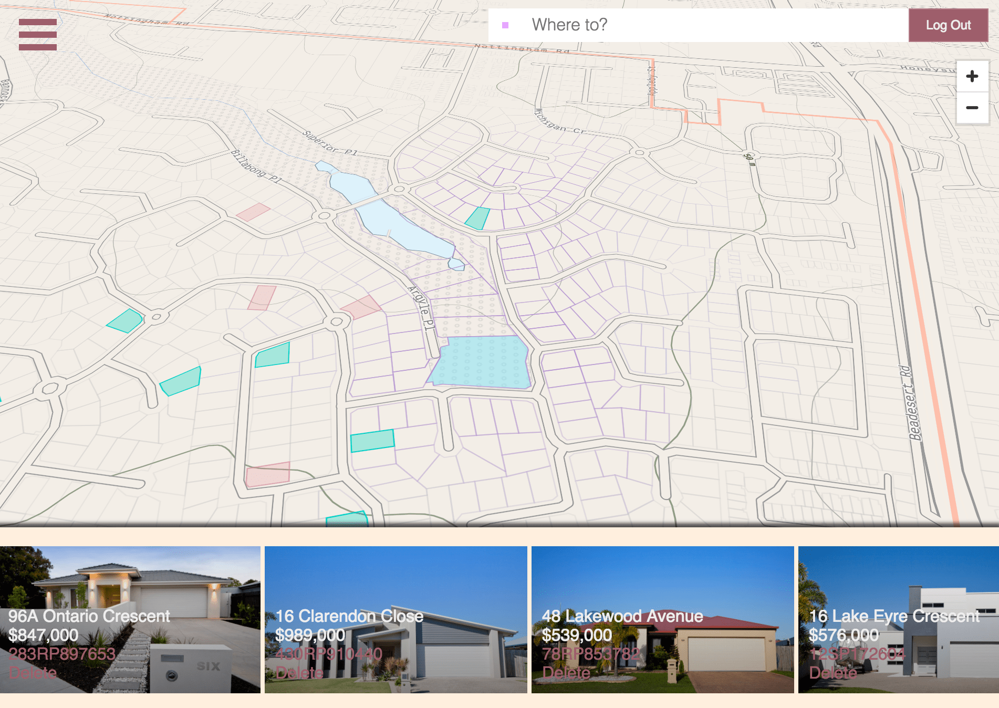

## Designing a Market for Unlisted Properties

### What is Real Estate Rumors?
Real Estate Rumors is a new map-based marketplace for real-estate.
There are 3 phases:

#### Phase 1: Prediction Market
Users can make predictions about when the property will list, and how much it will sell for on the map.
They earn rewards, info and reputation when they are correct and the property sells.
Once there is a liquid prediction market, we can begin to think about lettings people place indicators of interest.

#### Phase 2: Listings Lead Generator, and Options Platform
- Users will can place indications of interest (bids) on any property on the map.
- When +3 bids land on a property, we will send an alert to local agents and homeowners who can take the next steps to make the deal happen.
- The platform builds bidding demand first,then entices sellers to list on the platform.
- Dealmakers, and independent agents can write options on unlisted homes. E.g:
  1. Approach homeowners with an option to sell their home at a certain price (or above)
  2. Pay the homeowner a small fee for this option over the next ~3 months
  3. Find a buyer on the platform and exercise option (right to sell) the property

- Once Phase 2 is complete, we can incentivize predictions by giving correct predictions payoffs from proceeds of sale.

#### Phase 3: Online Auction Platform
- Decentralized market for real-estate transactions, mediated by arbiters
- Sellers can signup to the platform and view bidding demand for comparable homes
- They can choose to independetly list their house on the platform for private sale or auction sale based on whether they see bids land on their home.

This provides a mechanism to price unlisted properties so that:
1. Buyers can discover and express interest (bid) on any property on the map.
2. Agents can easily find new, exclusive listings based on latent bidding demand.
  - Reduce agent's time spent searching for listings (search costs).
  - Reduce costs/effort of property valuation for sellers.
3. Sellers can discover the value of their properties without exposing themselves by officially listing their property.
4. Expand the size and liquidity of the real-estate market 10-fold.
5. Turning Real-Estate into a product that 99% of people use, crowdsourcing localized property information.

The overarching vision and core values are:
1. __Universal access__: Liberate real-estate data. Data contributed by people should be universally free and accessible for the people.
2.  __Radical Transparency__: Property valuation and appraisals should be radically transparent and open for everyone.
3. __All Inclusive__: Access to the real-estate market should be universal. Everyone should be able to get into the market whether they are rich or poor. It starts by providing a fair and equal footing for understanding property valuations.

### What does this mean for Agents?
Existing real-estate platform platforms leverage their market power (via network effects) to extract monopoly rents from the very people who contribute to their success. Agents spend 70% of their looking for listings, in order to __pay theses platforms to list their listings__. This platform aims to change that.

Real-estate agents charge fees for essentially three services:
1. Reducing search frictions by finding and matching buyers to listings
2. Mediate information asymmetries between buyer and seller (due-diligence)
3. Mediate negotiations between buyer and seller
4. Show buyers open homes and marketing (physical services, rather than informational services)

By building this expanded market for predictions in real-estate (EMPIRE), agents can spend less time on (1) and (2), instead focusing
on negotiations and showing buyers homes and other physical services like pest control.
Agents who develop reputation on the platform can enjoy a steady stream of leads.

### Why does this make sense economically?
Traditionally, people have bought and sold homes in the following way:
1. Seller lists
2. Buyers browse and search for a home
3. Buyers makes an offer
4. Agents negotiate trade.

The problems that arise are:
1. Buyers access a limited stock, 2% of the potential real-estate market
2. Sellers are afraid of listing properties since they are unsure whether they can sell (particularly seller investors)
3. Price discovery is slow as a result, leading to momentum in property markets, property bubbles and delayed price discovery.

Real-estate markets are unique compared to other markets.

In commodity markets: price does the matching. Identity of the traders irrelevant.
In matching markets such as dating sites, price does not do the matching. Identity of the traders 100% relevant.

Most marketplaces fall somewhere on the spectrum.
Dating being the purest of matching markets, while markets for commodities like iron, corn, sugar, on the other extreme.
Marketplaces for labour (like freelancer fall somewhere in the middle since both the price matters, but also the identity of the product (labour) matters.

What’s interesting about property markets is that it exists outside of this spectrum.
1. Sellers view the market as a commodity market,
2. But buyers (excluding investors) view the market as as a matching market.

For these reasons:
- Sellers are averse to listing first, since they are unsure about demand, listing without sale lets buyers infer that the price is too high.
- Buyers select from a limited pool of desirable homes, settling for second best.
- Agents have trouble finding listings since they are unsure about supply (of listings) and demand (what buyers actually want).

